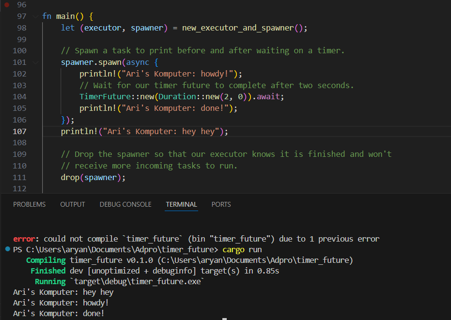
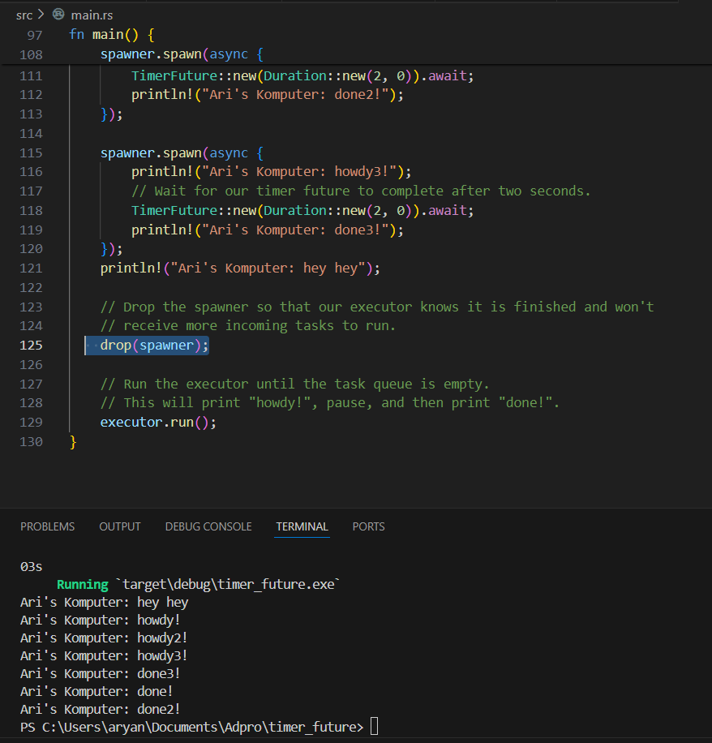
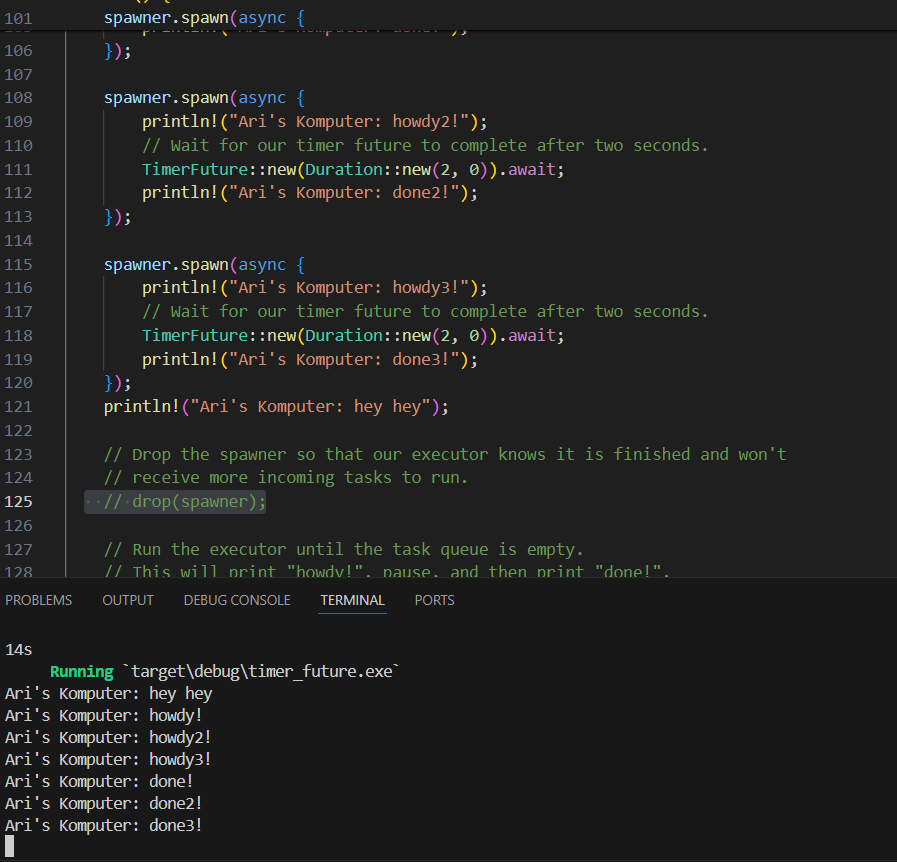

# Understanding how it works.

Pada bagian terminal untuk print dapat kita lihat bahwa 'Ari's Komputer: hey hey' dicetak lebih awal dibandingkan dengan kalimat yang lain. Padahal, jika kita melihat kode, print 'Ari's Komputer: hey hey' berada lebih bawah. Hal ini bisa terjadi karena print 'Ari's Komputer: hey hey' tidak berada dalam _async_ sehingga langsung dijalankan dan tidak menunggu waktu terlebih dahulu.

# Multiple spawn with drop

Ketika kita mengulang perintah print berkali-kali, sebenarnya kita tidak dapat menentukan bagian mana yang diprint terlebih dahulu. Hal ini disebabkan karena ketiga task tersebut berjalan secara asinkronous sehingga tidak bisa ditentukan mana yang berjalan lebih dulu atau belakangan. Pada kode di atas, diberikan spawn dengan drop sehingga program dapat langsung berhenti.

# Multiple spawn with no drop

Pada kode di atas, kita menghilangkan perintah untuk drop spawner yang kita buat. Hal ini menyebabkan kode terus berjalan karena program menunggu task baru yang mungkin akan dijalakan spawner.

